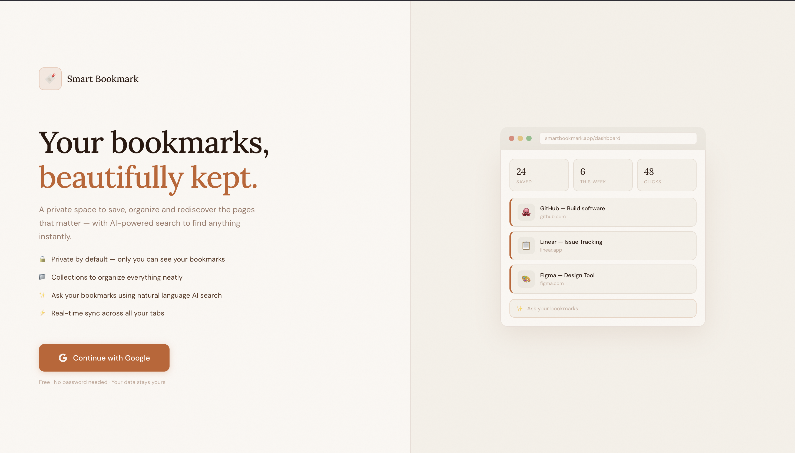
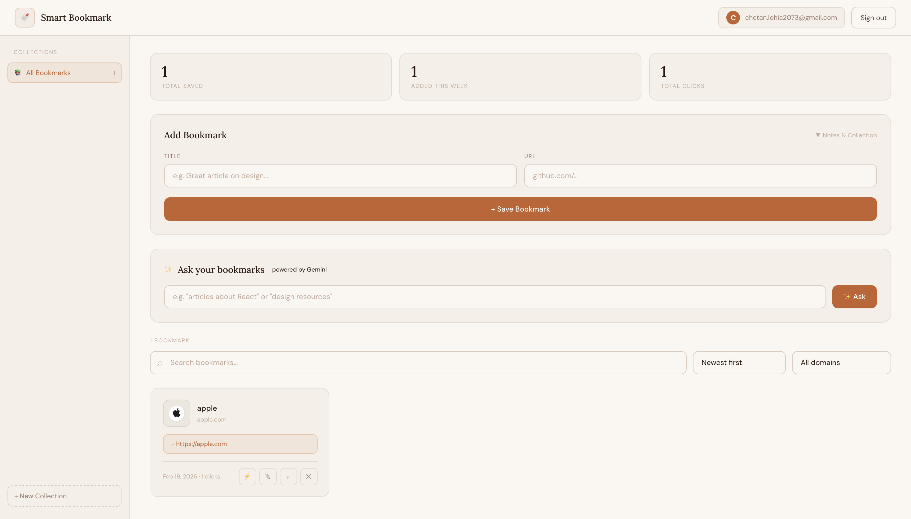

# 🔖 Smart Bookmark App

A secure, real-time, AI-powered personal bookmark manager built with Next.js and Supabase.

🔗 **Live Demo**: https://bookmark-app-rust-seven.vercel.app/
📦 **Repo**: https://github.com/chetanlohia0/Smart-bookmark-app

---

## ✨ Features

- **Google OAuth** — sign in with Google, no password needed
- **Private by default** — Row Level Security ensures only you see your bookmarks
- **Real-time sync** — changes appear instantly across all open tabs
- **Collections** — organize bookmarks into folders
- **Notes** — add personal notes to each bookmark
- **Edit & Delete** — full bookmark management
- **Click tracking** — see how many times you've visited each link
- **Link checker** — verify if a saved URL is still active
- **Duplicate detection** — prevents saving the same URL twice
- **Search, sort & filter** — by title, domain, date, or click count
- **Stats dashboard** — total saved, this week, total clicks
- **✨ Ask your bookmarks** — Gemini AI powered natural language search

---

## 🛠 Tech Stack

| Layer | Technology |
|---|---|
| Frontend | Next.js 15 (App Router), TypeScript, Tailwind CSS |
| Backend | Supabase (PostgreSQL, Auth, Realtime, RLS) |
| AI | Google Gemini API |
| Deployment | Vercel |

---

## 🏗 Architecture
```
app/
  login/          → Google OAuth login page
  dashboard/      → Protected dashboard (server + client components)
  auth/callback/  → OAuth callback handler
  api/
    gemini/       → Gemini AI search endpoint
    check-link/   → Link health checker endpoint

components/
  Navbar          → Top navigation with user info
  Sidebar         → Collections manager
  BookmarkForm    → Add bookmark form
  BookmarkCard    → Individual bookmark card
  ControlsSection → Search, sort, filter controls
  StatsBar        → Usage statistics
  AskBookmarks    → AI-powered natural language search

lib/
  supabaseClient  → Supabase browser client
  bookmarkActions → Add, edit, delete bookmark logic
  collectionActions → Collection CRUD
  utils           → URL validation, link checker
```

**Key architectural decisions:**
- Server Components fetch initial data — no loading spinner on first load
- Client Components handle realtime subscriptions and interactivity
- Middleware protects `/dashboard` — unauthenticated users redirected to `/login`
- RLS policies enforce data privacy at database level — not just app level

---

## 🗄 Database Schema
```sql
-- bookmarks
id          uuid primary key
user_id     uuid references auth.users
title       text
url         text
notes       text
click_count integer default 0
collection_id uuid references collections(id)
created_at  timestamp

-- collections
id          uuid primary key
user_id     uuid references auth.users
name        text
created_at  timestamp
```

---

## 🚀 Running Locally

### Prerequisites
- Node.js v18+
- A Supabase account
- A Google Cloud project (for OAuth)
- A Gemini API key

### Steps

**1. Clone the repo**
```bash
git clone https://github.com/chetanlohia0/Smart-bookmark-app.git
cd Smart-bookmark-app
npm install
```

**2. Set up Supabase**
- Create a new project at supabase.com
- Run this SQL in the SQL Editor:
```sql
create table bookmarks (
  id uuid default gen_random_uuid() primary key,
  user_id uuid references auth.users not null,
  title text not null,
  url text not null,
  notes text default '',
  click_count integer default 0,
  collection_id uuid references collections(id) on delete set null,
  created_at timestamp with time zone default now()
);

create table collections (
  id uuid default gen_random_uuid() primary key,
  user_id uuid references auth.users not null,
  name text not null,
  created_at timestamp with time zone default now()
);

alter table bookmarks enable row level security;
alter table collections enable row level security;

create policy "Users can view own bookmarks" on bookmarks for select using (auth.uid() = user_id);
create policy "Users can insert own bookmarks" on bookmarks for insert with check (auth.uid() = user_id);
create policy "Users can update own bookmarks" on bookmarks for update using (auth.uid() = user_id);
create policy "Users can delete own bookmarks" on bookmarks for delete using (auth.uid() = user_id);

create policy "Users can view own collections" on collections for select using (auth.uid() = user_id);
create policy "Users can insert own collections" on collections for insert with check (auth.uid() = user_id);
create policy "Users can update own collections" on collections for update using (auth.uid() = user_id);
create policy "Users can delete own collections" on collections for delete using (auth.uid() = user_id);

alter publication supabase_realtime add table bookmarks;
alter publication supabase_realtime add table collections;
```

**3. Set up Google OAuth**
- Go to console.cloud.google.com
- Create OAuth 2.0 credentials
- Add redirect URI: `https://your-supabase-url.supabase.co/auth/v1/callback`
- Add credentials to Supabase → Authentication → Providers → Google

**4. Create `.env.local`**
```env
NEXT_PUBLIC_SUPABASE_URL=your_supabase_url
NEXT_PUBLIC_SUPABASE_ANON_KEY=your_supabase_anon_key
GEMINI_API_KEY=your_gemini_api_key
```

**5. Run the app**
```bash
npm run dev
```

Open http://localhost:3000

---

## 🌐 Deploying to Vercel

1. Push code to GitHub
2. Import repo at vercel.com
3. Add environment variables in Vercel dashboard
4. Add your Vercel URL to Supabase → Authentication → URL Configuration
5. Deploy!

---

## 🧩 Challenges & Solutions

| Challenge | Solution |
|---|---|
| Supabase SSR cookies with Next.js App Router | Used `@supabase/ssr` with `createServerClient` and `createBrowserClient` |
| Realtime DELETE events missing `user_id` in payload | Removed `filter` from DELETE subscription, filter client-side instead |
| Collections not updating in realtime | Manually added collections table to `supabase_realtime` publication via SQL |
| Gemini model deprecation | Switched from `gemini-1.5-flash` → `gemini-3-flash-preview` |

---


## 📸 Screenshots

### Landing Page


### Dashboard



Built by **Chetan Lohia** · 2026